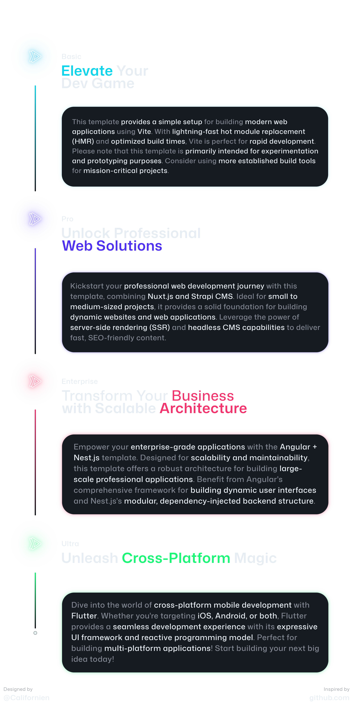

<h1 align="center">CFNX Webdev Setup Pro</h1>
<h3 align="center">Free and Advanced Webdevelopment Template using Nuxt.js and Strapi CMS</h3>
<br>

## Main Information

**This template provides a robust foundation for building scalable web applications, leveraging the power of Nuxt.js for frontend rendering and Strapi as a flexible headless CMS (Content Management System). Ideal for developers looking to kickstart their projects efficiently, it combines the structured components of Nuxt.js with the versatile content management capabilities of Strapi, ensuring a seamless development experience from start to finish. _Perfect for small, but professional web apps!_**

## ✨ Special Features

### 🌐 [Nuxt.js](https://nuxt.com/)

Nuxt.js streamlines web development with universal application support, simplified configuration, and automatic code splitting for enhanced performance. Its modular architecture and static site generation capabilities ensure scalability and fast load times, backed by a vibrant community and extensive ecosystem.

### 📊 [Strapi CMS](https://strapi.io/)

Strapi simplifies content management with a flexible, open-source headless CMS (Content Management System). It allows developers to quickly build APIs for content delivery across various platforms and devices. With customizable content structures, role-based access control, and a plugin system, Strapi offers flexibility and scalability without being tied to a specific frontend technology. Its intuitive admin panel makes content creation and management straightforward, while its open-source nature and active community ensure continuous support and extensibility.

### 💻 [GitHub Actions](https://github.com/features/actions)

This project uses GitHub Actions for automated workflows, including code formatting with Prettier, linting with ESLint and testing with Vitest. These workflows ensure our codebase remains clean, adheres to standards. It's also extensible, so you can add custom workflows to automate your workflows.

---

## Setup

**Setup this coding environment with this command, which automatically sets up the whole repo.**

```bash
npm run setup
```

**This will install strapi in quickstart mode. If you want to install it with custom settings, run this command:**

```bash
npm run setup -- --custom
```

## Commands

**Start the dev-server**

```bash
npm run dev
```

==> _Starts the development servers on_ `http://localhost:3000/` (=> Nuxt.js) _and_ `http://localhost:1337/` (=> Strapi) _._

**Build the application**

```bash
npm run build
```

==> _Builds the app, both frontend and backend._

**Preview the build**

```bash
npm run preview
```

==> _Starts preview servers of the builds on_ `http://localhost:3000/` (=> Nuxt.js) _and_ `http://localhost:1337/` (=> Strapi)_._

**Test the code (nuxt, vitest)**

```bash
npm run test
```

**Create a coverage page of testing**

```bash
npm run coverage
```

**Lint the code (eslint)**

```bash
npm run lint
```

**Format the code (prettier)**

```bash
npm run format
```

_All these commands must be executed in the root directory._

## Template Comparison

### Recommended Template-Usecases



### (Un)Supported Features

|                                |   [**Basic**](https://github.com/Californien/cfnx-webdev-setup)    |                              **Pro**                               | [**Enterprise**](https://github.com/Californien/cfnx-webdev-setup-enterprise) | [**Ultra**](https://github.com/Californien/cfnx-webdev-setup-ultra) |
| :----------------------------- | :----------------------------------------------------------------: | :----------------------------------------------------------------: | :---------------------------------------------------------------------------: | :-----------------------------------------------------------------: |
| CLI Commands                   |   |   |              |    |
| SASS / SCSS Support            |   |   |              |    |
| Code Formatting                |   |   |              |    |
| Linting                        |   |   |              |    |
| Testing                        |   |   |              |    |
| CI/CD Integr. (GitHub Actions) |   |   |              |    |
| ENV-Variables Support          |  |   |              |    |
| Routing                        |  |   |              |    |
| Middleware Functionality       |  |   |              |    |
| SSR                            |  |   |              |    |
| Database Support               |  |   |              |    |
| Enterprise-Grade Features      |  |  |              |    |
| Multi- & Cross-Platform        |  |  |             |    |
